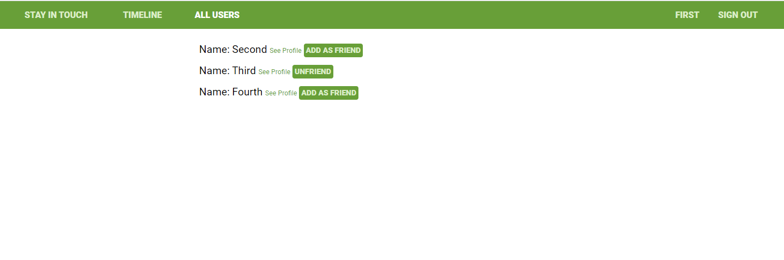
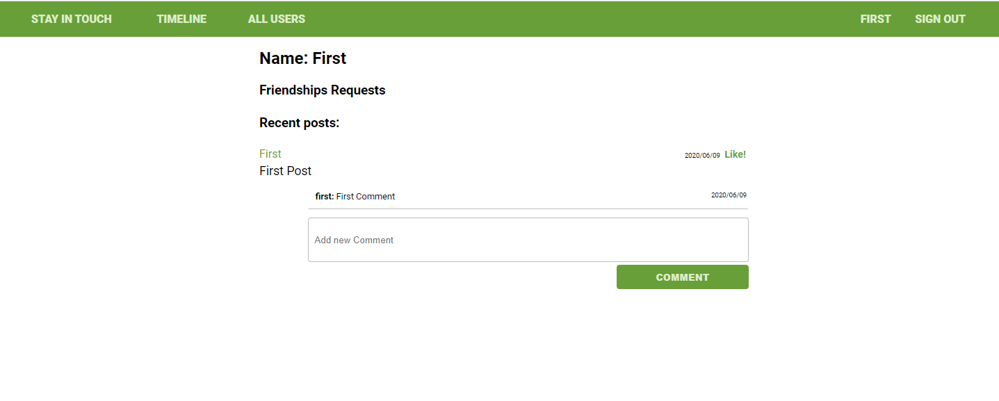
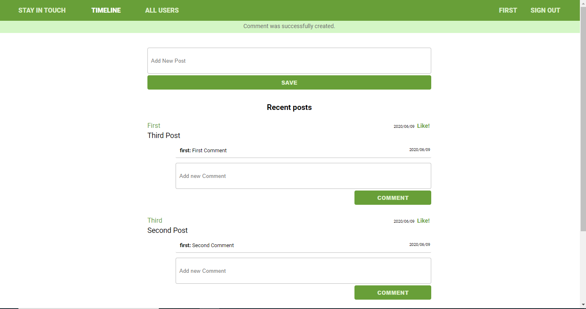
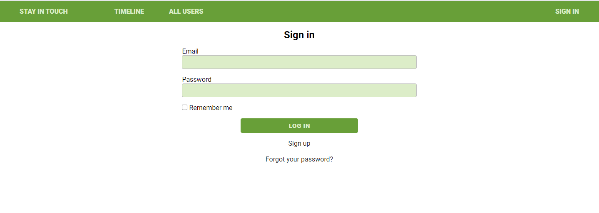

# Scaffold for social media app with Ruby on Rails

> This project is a social media with functionalities similar to facebook. You can create an account, add other users as friends, create posts, write comments on posts and like posts or comments






## Built With

- Ruby v2.7.0
- Ruby on Rails v5.2.4
- Devise Gem
- PostgreSQL

## Live Demo

[Link](https://desolate-plains-71024.herokuapp.com/)


## Getting Started

To get a local copy up and running follow these simple example steps.

### Prerequisites

Ruby: 2.7.0
Rails: 5.2.4
Postgres: >=9.5

### Setup

Instal gems with:

```
bundle install
```

Setup database with:

```
   rails db:create
   rails db:migrate
```


### Usage

Start server with:

```
    rails server
```

Open `http://localhost:3000/` in your browser.

### Run tests

```
    rpsec --format documentation
```

> The tests included in this project are unit tests with Rspec and integration tests with Rspec and Capybara.

## Authors

👤 **Julian Blasco**

- Github: [@Blasco9](https://github.com/Blasco9)
- Linkedin: [Julian Blasco](https://www.linkedin.com/in/julian-augusto-blasco-1656a0153/)

## 🤝 Contributing

Contributions, issues and feature requests are welcome!

Feel free to check the [issues page](issues/).

## Show your support

Give a ⭐️ if you like this project!

## Acknowledgments

- The Odin Project
- Microverse

## 📝 License

This project is [MIT](lic.url) licensed.

